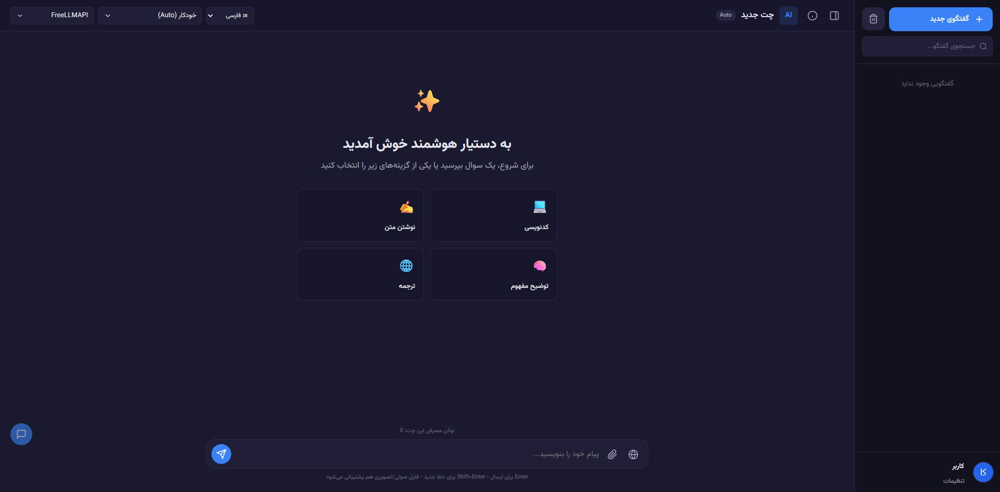
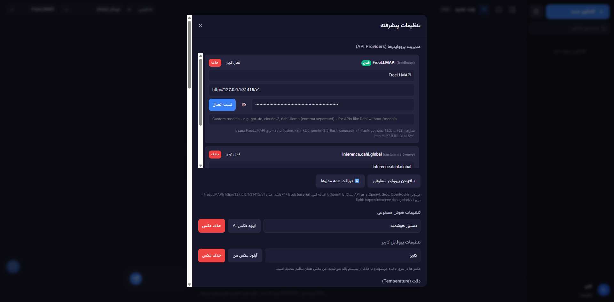
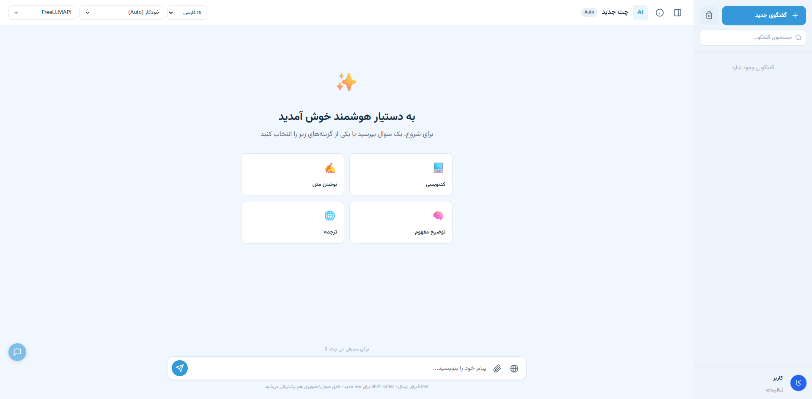

<div align="center">

# GUI Advanced Chat API

**A modern, lightweight, standalone web interface for interacting with OpenAI-compatible AI models**

[🇮🇷 فارسی](README.md) | [🇬🇧 English](README.en.md)

<br>

**Current Version: v2.2.0**

[](LICENSE)
[](https://www.php.net/)
[](#)
[](#)

</div>

---

# Introduction

**GUI Advanced Chat API** is a modern, responsive, and lightweight web interface for chatting with Large Language Models (LLMs). It is built entirely with pure PHP and works without any heavy frameworks or databases.

The project supports **any OpenAI-compatible API**, including **OpenAI**, **Groq**, **OpenRouter**, **FreeLLMAPI (Local)**, **Dahl**, and other compatible providers.

It includes advanced features such as **real-time streaming responses**, **Markdown + KaTeX + Syntax Highlighting**, **multi-provider management**, **file/image/audio/video uploads**, **chat history with recycle bin**, **100+ color themes**, **bilingual support (English/Persian)**, and much more.

Designed for:

* AI developers and enthusiasts
* Running on standard PHP shared hosting
* Local deployments and easy customization

---

# Preview

> Images are located in the `.github/images` directory.

<p align="center">
  
</p>

## Settings

<p align="center">
  
</p>

## Light Mode

<p align="center">
  
</p>

---

# Key Features

## 🎨 User Interface & Experience

* Modern, clean, and fully responsive UI (Desktop & Mobile)
* Full RTL (Persian) and LTR (English) support with instant language switching
* **100+ beautiful color themes**
* Multiple response animations (Typewriter, Word-by-word, Fade, Smooth, or None)
* Smart auto-scroll that won't interrupt while you're reading older messages
* Progressive AI response rendering with **Stop Generation** support
* Editable quick prompts (up to 4 custom prompts)
* User message navigation and chat search

---

## 🤖 AI Features

* Full support for **OpenAI-compatible APIs** (OpenAI, Groq, OpenRouter, FreeLLMAPI, Dahl, and similar services)
* Multi-provider management (Add, Edit, Test Connection, Enable/Disable)
* Model selection with search and Auto mode
* **True Streaming (SSE)** with automatic fallback to non-streaming mode
* **Web Search** support (currently available for FreeLLMAPI)
* Temperature control
* Mathematical formula rendering using **KaTeX**
* Full Markdown rendering with **Highlight.js** syntax highlighting
* Upload and send:

  * Images (Base64)
  * Audio
  * Video
  * Text files (`txt`, `md`, `json`, etc.)
  * Up to **20 MB**
* Token usage display for each conversation

---

## 💾 Data Management & Customization

* **No Database Required** — everything is stored in JSON files
* Complete chat history with search, recycle bin, restore, and permanent deletion
* User & AI profiles (custom names and uploadable avatars)
* Chat backup and restore (JSON Export/Import)
* Simple, modular architecture for easy customization and development

---

## ⚙️ Technical

* Built with **Pure PHP**, Vanilla JavaScript, and CSS
* Lightweight codebase with a simple folder structure
* Runs perfectly on standard shared hosting
* Clean, maintainable, and extensible code

---

# Requirements

* PHP **7.4** or newer (PHP 8.0+ recommended)
* **cURL** extension (required for API communication)
* **GD** extension (optional, for avatar resizing)
* Write permission for the `data/` directory (created automatically)
* Apache, Nginx, or PHP's built-in development server (`php -S`)

---

# Installation

## Option 1 — Shared Hosting

1. Download or clone the repository.
2. Upload all project files to your `public_html` directory (or any subdirectory).
3. Make sure the `data/` directory is writable (it will usually be created automatically with appropriate permissions).
4. Open the project in your browser.
5. Go to **Settings** and configure your provider and API key.

---

## Option 2 — Local Development

```bash
git clone https://github.com/abalfazljam/GUI-advanced-chat-API.git
cd GUI-advanced-chat-API
php -S localhost:8000
```

Then open:

```
http://localhost:8000
```

Go to **Settings**, add your preferred provider, enter your API key, and start chatting.

---
